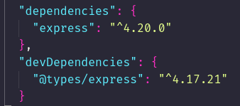
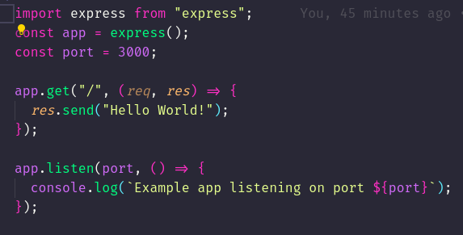
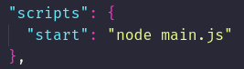
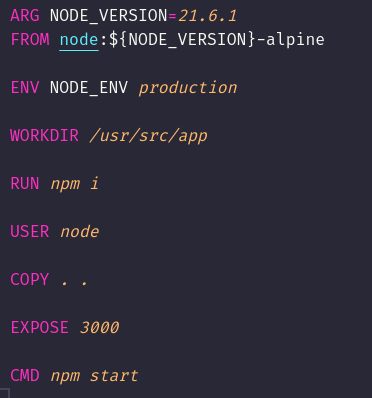
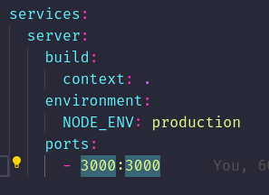
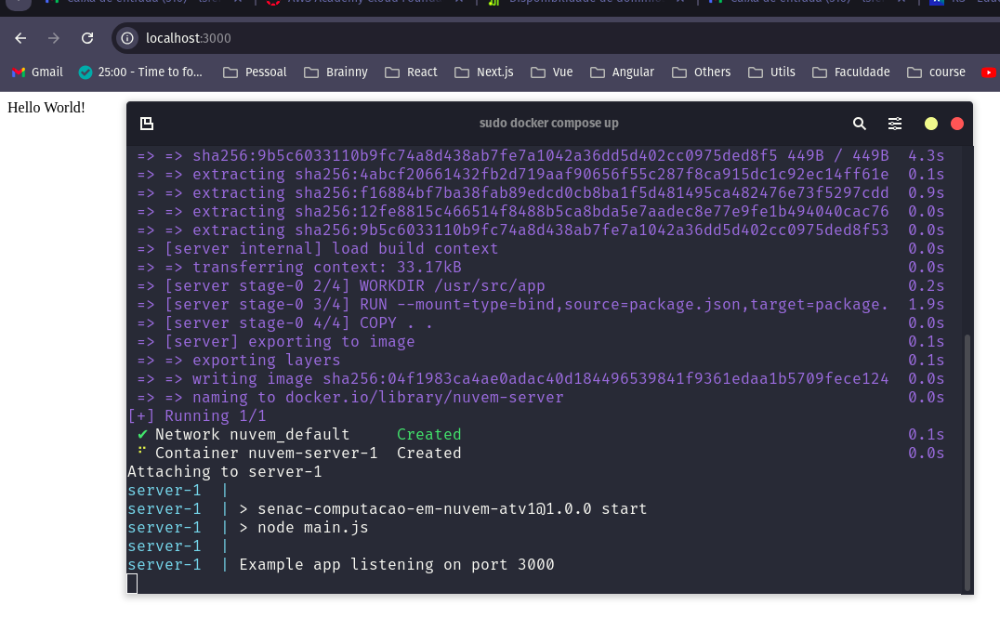

## Como rodar o servidor

`docker compose up --build`.

O Servidor estará disponivel na seguinte URL http://localhost:3000.

## Passos realizados
1. **Iniciei o projeto com** `npm init`.

2. **Instalei o** `express` **como dependência.**
   > 

3. **Criei um arquivo** `main.js` **com a configuração básica do meu servidor.**
   > 

4. **Adicionei dentro no meu arquivo** `package.json` o script responsavel por iniciar o servidor.
   > 

5. **Criei um arquivo** `Dockerfile`**, utilizando uma imagem do** `nodejs` **na** *versão 21.6.1* **e adicionei as configurações necessária para rodar meu serviço.**
   > 

6. **Criei um arquivo** `docker-compose.yaml` **para simplificar a execução do projeto.**
   > 

## Projeto rodando

